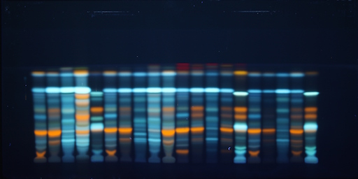
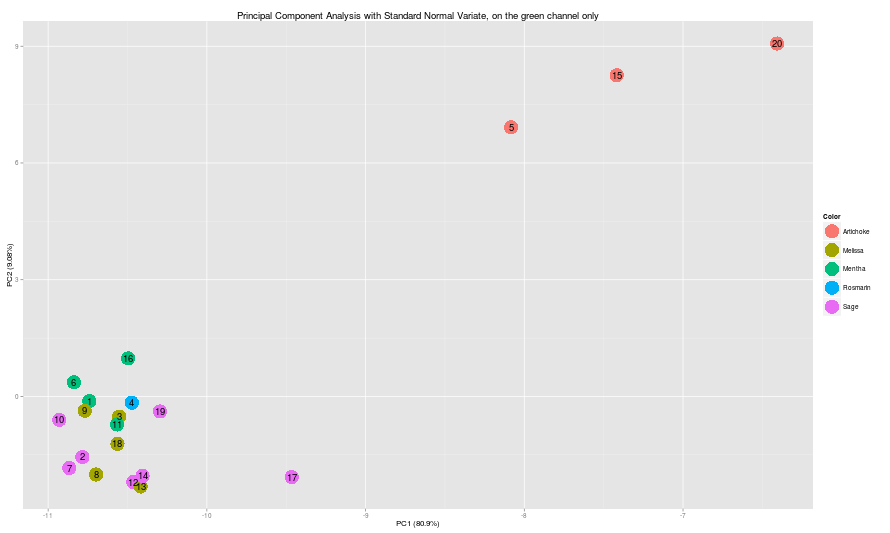

===========

## Work In Progress
This is a work in progress. For details, feedback or code, [contact me](mailto:dimitrifichou@gmail.com)

## Abstract

Chemometrics apply to planar chromatography is a field really new in comparaison to other field of analytical chemistry. Here we present a new method to combine the two in a new way. The method is based on 4 phases: deconstruction of the 3D array, training of a machine learnign model, extraction of new data from the model, reconstruction of an array. At the difference of the previous approach of data science in HPTLC, the technique do not include a step of chromatograms extraction but take all the available data in the pictures. Potential application of this method are: denoizing, alignment, sample clusterisation, channel expansion, baseline correction. The final aim of such technology is to produce a system able to learn to interpret by himself HPTLC data and help chemists in their analyse.

## Introduction

### HPTLC

High Performance Thin Layer Chromatography is a technique of anlytical chemistry used widely in the industry [reference needed]. Samples in liquid phase are applied on a planar stationnary phase, tipycally a 20cm*10cm plate with particules of Si02 on the micrometer scale. The plate is then deeped in solvent or micture of solvent, the mobile phase. Then, by capilary effect, the mobile phase will migrate on the plate and depending of numerous interaction, the molecules of the samples will migrate with it at different speed resulting of their separation. Once this separation step is done, a picture is taken of the plate, possibly under different light, or preceded by a step of derivatization for specific or sensible detection [reference needed].

### Chemometrics and HPTLC: data preparation

Until the entrance of chemometrics, the interpretation of the data was made by human eyes, or via hyphenation with other techniques like mass spectrometry or densitometry [reference needed]. With this human interpretation step come subjectivity and so error. With the use of data science, it's became possible to bring more objectivity into the process [reference needed]. Most of the picture today consist of a 3D array with pixels in the first two dimension and the RGB space in the third. From this picture and with the information of the sample application, chromatograms could be extracted for each samples [figure chrom extraction]. Different preprocessing step are used to produce a ready to use signal like smoothing, baseline removal, peak alignment [ref R package dtw and ptw], manual or automatic peak integration [ref gregory] or standardisation. The resulting signals could be then taken as unique multivariate fingerprint, considering one channel, a subset of one channel or all channel together. 

### Chemometrics and HPTLC: data analysis

There is a huge quantity of algorythm available to analyse data, they could be separate into two big group: unsupervised and supervised, i.e. without and with information about the samples. 

* Unsupervised will be use to explore a dataset, to highlight and recognise pattern into the data, in HPTLC, most used Principal Component Analysis and Hierarchical Cluster Analysis [reference needed] but k-nearest neighbor was also used [Tian R, Xie P, Liu H (2009)]. 

* Supervised will use information about each sample to optimize the way the model describe the dataset in order to predict a discrete value, _classification_, or a continous value, _regression_. Algorythm used were for example Partial Less Square Discriminante analysis, Linear Discriminante Analysis[ref], Artificial Neural Network[ref].

### PARAFAC approach

One specificity of HPTLC picture data is that the raw data are in the form of a 3D array. Most of the algorythm used before take as input a matrix and therefore, the array must be subseted or unfolded before analysis. The PARAFAC method takes into acount the multiple dimensions in order to extract the important information of the dataset and allows to explore it globally.

### Chemometrics and HPTLC: constraints

Despite the growing interrest for the combinaison of HPTLC and chemometrics, the application is not simple yet. 

* The algorythm used here are not fit to deal with shift in peak position, a common phenomenone in chromatography, the use of peak realignment help but is artificial and could potentially lead to new errors. 

* Secondly, because of the high sensibility of human eyes to blue color, the RGB space is deformed in order to capture little amount of this color, this lead to peak saturation. 

* Finally, a carefull standardisation of the process of data production must be observed in order to avoid adding more sampling error to the process. If variability during the chemical process could be minimize but not eliminate, parameters like picture exposure time, cropping, chromatogram extraction need to be standardize in order to grow a reliable data collection.

### Chemometrics and HPTLC: advantage

Howewer, this combinaison is also particulary interesting for two reasons. 

* The first one is the ability to analyse data fastly and in parallel, a must have to collect the necessary amount of data for data mining. 

* The second is the fact that this technic was build around the visualisation, the main output is a picture, a widely used format in data science. Indeed, one of the big challenge of artificial intelligence is to reproduce decision based on vision.

### Human brain interpretation of HPTLC data

When **trained** human eyes see an HPTLC picture, many information are already processed. 

* Samples separation is automatic because it's easy to clusterize the verticales lines by similarity and to see how many sample are on the plate. 

* Peak deconvolution is possible much better than on the chromatograms extracted from the picture because our brain is trained to recognise and separate color. 

* Shift in Rf are abstracted and the mind make automatically the correction. 

* Noise could be annoying but the signal appear by himself automatically by looking at the big picture and comparing the differents zones. 

Different points are important here. 

* First of all, the brain is able of such operation because he is train to do so, somebody with no knowledge of analytical chemistry will not see anything but even a chemist with no training in HPTLC will need to see a few picture before seeing all of that. 

* Secondly, all those questions depend of a point of view, they are dimension related, counting the number of sample means looking at verticale line while separate the molecules signal means looking at the individual pixels. 
* Finally, all of this is possible because there is a massive amount of information available, a 2.000*1.000 pixels picture contains 2.000 chromatograms, 1.000 Rf and 2.000.000 pixels. This last point is quite unique in chemometrics where we almost never deal with lots of samples, even if here, samples is exagerate. Those new numbers allow us to work with much complicated and powerfull algorytms than before.

## Experimentale part

In [the rTLC application](https://dimitrif.shinyapps.io/rtlc), we used a tedious step to extract one chromatogram per sample, also, a batch had to be added during the process to associate dependent variables to each sample. Here we consider the full picture and we extract those information in a fully unsupervised way. The final aim of this work is nothing less than teaching a computer how to interpret HPTLC data, to our knowledge, there isn't any technique of analytical chemistry that allows one to produce in a single run thousands of observations. Further along the same idea, we take advantage of the high correlation in the 3 dimensions, this particularity allows one to play with the data from different points of view. 

### TLC brain: principle: deconstruction, training, extraction reconstruction

The main process is to deconstruct the array, apply an unsupervised machine learning algorythm, extract something from the model (could be the reconstruction, the new units or distances and many other possibilities), and finally reconstruct the array (the dimensions may change). This kind of process could be then used in series to piece different processes together. A full understanding of the deconstruction/reconstruction step is necessary to produce such pipeline, or at least one that makes sense.

### Programming language

The present work was writen in the R programming language [ref R core team] and with the help of a few packages [ref packages]. The final output is a [web application](https://dimitrif.shinyapps.io/TLC-brain) that allow the user to explore the possibility of the method with a demonstration dataset or with his own data. 

### Pipelines

For the moment, there is 4 pipelines in the application, no report to download back or quantitative analysis, the idea is just to present this new technology and to see how this process could transform the data and see through them.

#### New color generator

In this tab, there is no machine learning involved, the idea is to introduce the user to new color generation. In the first plot, the user can click on a pixel to generate the new color, an algorythm will calculate the euclidean distance between each pixel of the picture and the target pixel, what is returned by the algorithm then is the negative of this picture. The idea is to step out of the classic RGB channels and create a new color for more sensitivity in quantitative and qualitative analysis. On the picture, it is then possible to click to extract a specific set of chromatograms from the original data and the new data. From my experience, this technique shows good results by calculating the distance to the background on 366 nm, 254 nm and bioassay pictures. But distance to a specific color could also give selective results and should be explored.

#### Kohonen: Pipeline 1

This pipeline uses kohonen self-organised map to clusterize the data [ref kohonen package](http://www.jstatsoft.org/article/view/v021i05/). There are 2 steps in the process:

* The first one deconstructs the array into pixels, it uses a 2\*5 kohonen map to classify them and reconstruct the array using the distance to each unit instead of the RGB channels. So we go from an X\*256\*3 array to an X\*256\*10 array.

* The second process deconstructs the array by chromatograms, it also uses a 2\*5 kohonen map to classify them and reconstructs with the winning unit of each chromatogram, so we go from an X\*256\*10 array to an X vector with X the horizontal number of pixels (depending of the original ratio).

Here the user can look at the original picture and at the chromatograms. In the first process, you can select a color in the map and look at each new black and white picture and the resulting chromatograms for the new and the old channels. In the second process, you can click on each unit of the map and see what chromatograms belong to this unit on the original picture.

#### RBM: Pipeline 1 and 2

This tab uses Restricted Boltzman Machine [ref RBM hinton etc...] to train a neural network in an unsupervised way. The system will then reproduce the original data by predicting the value of the hidden unit and reproduce the original input according to the weights of the network. What is learn by the model is the parameters that gouvern the distribution in the input data.

We are looking at the chromatograms for pipeline 1 and the pixels for pipeline 2.

## Result and discussion

Two way of unfold the data were explore here: by looking at the pixel side or by looking at the chromatogram side.

### Pixel side

This technic could be seen as a preprocessing in order to transform the RGB channel into something more fit to the dataset used. 

For the first technic, the new color generation by calculation of the distance between a target pixel and the rest of the 3D array, it's possible to generate a new channel, figure X and figure X show the new channel when the target pixel is selected in the background, a _black_ channel or on a orange band, a _orange_ channel. We can see that the black and white picture is completely transform and the resulting chromatograms also. One important remark here is that the way the distance is calculated could lead to more sensible and selective result.

For the kohonen pipeline 1, the first process allow one to create 10 new channels and to observe the result on each of the newly created channel. Here the distance is not calculated according to the euclidean distance and lead to more selective channel than with the precedent pipeline. Also, the target color are selected automatically from the dataset so are more fit to the data. We can see on the chromatogram that the peak resolution is better with almost a return to the baseline so this method ould be use for baseline correction. 

With the RBM pipeline 2, a one layer hidden unit neural network with 8 unit, 10 iterations, a batch size of 100, a momentum of 0.5 and a learnign rate of 0.8 take the input data and is trained in order to reproduce the data set. The reproduction is not perfect and some band disapear during the process, the red band of chlorophil for example. But Once again, the data are transformed and the baseline is visually more cleaner. It's possible to vidualise how the data are seen through each hidden unit before the reconstruction, at the difference of the kohonen mapping, this is not quite clear if this is a specific color that is seen by the network as some unit show without normalisation only 1 or only 0 values.

### Chromatographic side

This point of view could be seen as automatic clusterisation of chromatograms.

For the kohonen pipeline, the chromatograms after the RGB expansion are presented to a 5*2 map and the chromatograms are clusterize by affinity. by clicking on each cell, it's possible to observe in the original data which samples are considered as alike by the system. We can see with the demo data that the back ground and some interband form generally one group, that the artichoke samples form one or two other group. The 4 intense bands of melissa and rosmarin will form 2 group close together while the mentha and salvia will from the rest of the unit. The method show good result for this dataset because the signal/noise ratio is high, howewer, with other picture where the noise is huge, an other step of denoising and normalisation could be necessary to help the system tell apart the samples.

The RBM pipeline is composed of one hidden layer of 16 unit, 100 iterations, a batch size of 10, a momentum of 0.5 and a learning rate of 0.8.
The result are also quite interesting, if the reconstruction is not perfect, the system clearly clusterize the samples together and try to classify the drug by class as a human will do. the third plot show the values of the hidden unit and is quite difficult to interpret at first.

## Conclusion

This new technology opens the door to artificial intelligence applied to planar chromatography data. By droping information about each sample and choosing to operate in a full unsupervised way, we can access to machine learning technics non usable before. The next step is to apply this kind of process with thousands of pictures, super computer will be needed on the way to process such dataset. The final product will be a system able to process continiously HPTLC pictures. I believe that such system will be able to recognise sample classes but also molecules presence or other sample properties we do not suspect yet. With enough data, it will be possible to abstract sampling errors, noise, peak shifting and other experimental problems. Only two algorythm were used here: kohonen self organised map and restricted boltzmann machine. Other technics based on neural network could lead to good result and must be investigated in futur studies: recurrent neural network and convolusionnal neural network.

## References

Kohonen T (2001). Self-Organizing Maps. Number 30 in Springer Series in Information Sciences. Springer-Verlag, Berlin, 3 edition.

Ranzato, M., Poultney, C., Chopra, S., & Cun, Y. L. (2007). Efficient Learning of Sparse Representations with an Energy-Based Model. Advances in Neural Information Processing Systems, 1137–1144. Retrieved from http://papers.nips.cc/paper/3112-efficient-learning-of-sparse-representations-with-an-energy-based-model

Lee, H., Grosse, R., Ranganath, R., & Ng, A. Y. (2009). Convolutional deep belief networks for scalable unsupervised learning of hierarchical representations. Proceedings of the 26th Annual International Conference on Machine Learning ICML 09, 2008, 1–8. http://doi.org/10.1145/1553374.1553453

Hinton, G. E. (2006). A Fast Learning Algorithm for Deep Belief Nets, 1554, 1527–1554. http://doi.org/10.1162/neco.2006.18.7.1527

Bengio, Y., Lamblin, P., Popovici, D., & Larochelle, H. (2007). Greedy Layer-Wise Training of Deep Networks. Advances in Neural Information Processing Systems, 19(1), 153. http://doi.org/citeulike-article-id:4640046

Winston Chang, Joe Cheng, JJ Allaire, Yihui Xie and Jonathan McPherson (2015). shiny: Web Application Framework for R. R package
  version 0.12.2. http://CRAN.R-project.org/package=shiny

Simon Urbanek (2014). jpeg: Read and write JPEG images. R package version 0.1-8. http://CRAN.R-project.org/package=jpeg

Simon Urbanek (2013). png: Read and write PNG images. R package version 0.1-7. http://CRAN.R-project.org/package=png

Simon Urbanek (2013). tiff: Read and write TIFF images. R package version 0.1-5. http://CRAN.R-project.org/package=tiff

Tony Plate and Richard Heiberger (2015). abind: Combine Multidimensional Arrays. R package version 1.4-3.
  http://CRAN.R-project.org/package=abind
  
Gregoire Pau, Florian Fuchs, Oleg Sklyar, Michael Boutros, and Wolfgang Huber (2010): EBImage - an R package for image processing
  with applications to cellular phenotypes. Bioinformatics, 26(7), pp. 979-981, 10.1093/bioinformatics/btq046

Stefan Milton Bache and Hadley Wickham (2014). magrittr: A Forward-Pipe Operator for R. R package version 1.5.
  http://CRAN.R-project.org/package=magrittr

Hadley Wickham (2011). The Split-Apply-Combine Strategy for Data Analysis. Journal of Statistical Software, 40(1), 1-29. URL
  http://www.jstatsoft.org/v40/i01/.
  
JJ Allaire, Jeffrey Horner, Vicent Marti and Natacha Porte (2015). markdown: 'Markdown' Rendering for R. R package version 0.7.7.
  http://CRAN.R-project.org/package=markdown

R. Wehrens and L.M.C. Buydens, Self- and Super-organising Maps in R: the kohonen package J. Stat. Softw., 21(5), 2007

Xiao Rong (2014). deepnet: deep learning toolkit in R. R package version 0.2. http://CRAN.R-project.org/package=deepnet
